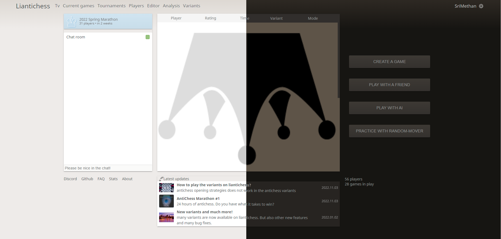

# [Liantichess](https://liantichess.herokuapp.com)

[](https://github.com/SriMethan/Liantichess/actions/workflows/nodejs.yml)
[](https://liantichess.herokuapp.com/players)



Liantichess is a free, open-source antichess variants server designed to play antichess and antichess variants.

All supported games on Liantichess can be seen [here](https://liantichess.herokuapp.com/variants)

For move generation, validation, analysis and engine play it uses
- [Fairy-Stockfish](https://github.com/ianfab/Fairy-Stockfish)
- [fairyfishnet](https://github.com/theyobots/fairyfishnet) fork of [fairyfishnet](https://github.com/gbtami/fairyfishnet)
- [lichess-bot-variants](https://github.com/gbtami/lichess-bot-variants) fork of [lichess-bot](https://github.com/careless25/lichess-bot)

On client side it is based on [chessgroundx](https://github.com/gbtami/chessgroundx) fork of [chessground](https://github.com/ornicar/chessground)

##

liantichess is a free server and it will remain free forever.

## Installation

### Prerequisites
* You need mongodb up and running. [Mongo daemon](https://docs.mongodb.com/manual/installation/)

```
pip3 install -r requirements.txt --user 
yarn install                            
yarn dev                                
yarn md                
python3 server/server.py
```

The Wiki further describes [how to setup a development environment](https://github.com/SriMethan/Liantichess/wiki/Setting-up-a-Liantichess-Development-environment-locally).

## Supported browsers

Liantichess should support almost all browsers. Though older browsers (including any version of Internet Explorer) will not work. For your own sake, please upgrade. Security and performance, think about it!

Only [Fairy-Stockfish analysis](https://liantichess.herokuapp.com/analysis/antichess) might not work on all browsers. The browser support can be found [here](https://github.com/TheYoBots/stockfish.wasm#requirements).

## Credits

Credits to @gbtami for the main [code](https://github.com/gbtami/pychess-variants)
