# PyChess game creation flows

This document describes how **live playable games** are created in the current PyChess codebase, which client/server files participate, which HTTP routes are rendered, and which WebSocket, SSE, or HTTP messages move the browser from game setup to the round board.

It replaces the earlier compact table with diagrams covering:

- open lobby seeks;
- direct human challenges;
- built-in AI games;
- external BOT challenges;
- friend invitation links;
- tournament-director hosted games;
- automatic pairing;
- rematches;
- tournament and simul pairings;
- the shared `Seek -> Game -> round` pipeline.

> Scope: live games created by the uploaded source snapshot. PGN import also creates a database game document, but it creates a finished/imported record rather than a live matchmaking game and is therefore listed separately near the end.

## 1. Terminology and transport legend

| Term | Meaning in this document |
|---|---|
| **Lobby websocket** | `/wsl`, handled by `server/wsl.py`; used by `client/lobby.ts`. |
| **Round websocket** | `/wsr/{gameId}`, handled by `server/wsr.py`; used by `client/roundCtrl.ts`. |
| **Tournament websocket** | `/wst`, used for tournament updates and new-game redirects. |
| **Simul websocket** | `/wss`, used for simul updates and new-game redirects. |
| **Challenge SSE** | `/challenge/subscribe`, handled by `server/header_challenges.py`. |
| **Invite SSE** | `/api/invites/{gameId}` and `/api/bot-challenges/{gameId}`, both handled by `subscribe_invites()` in `server/game_api.py`. |
| **Seek** | A pending game specification and one or two partially assigned seats, represented by `Seek` in `server/seek.py`. |
| **Reserved game ID** | An eight-character game ID allocated before the game exists. Friend invites, hosted games, and BOT challenges use it as the public waiting-page ID and later as the actual game ID. |

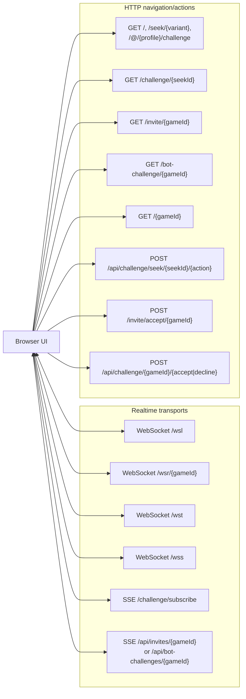

## 2. High-level game creation architecture

Most interactive creation methods converge on `join_seek()` and `new_game()` in `server/utils.py`. Tournament and simul pairings are the main exceptions: they construct `Game` directly.

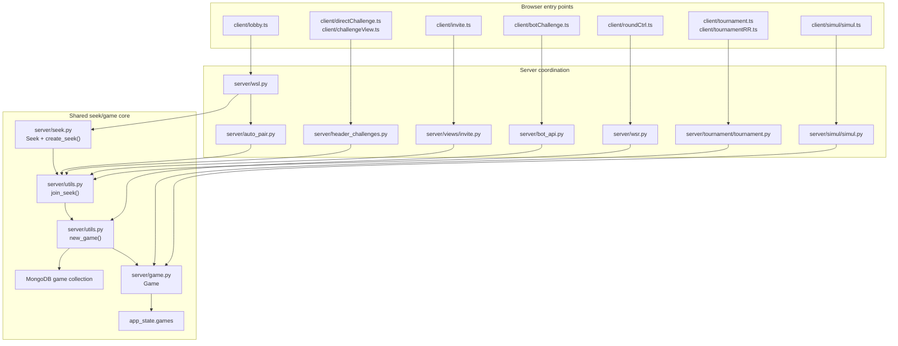

## 3. Creation-method overview

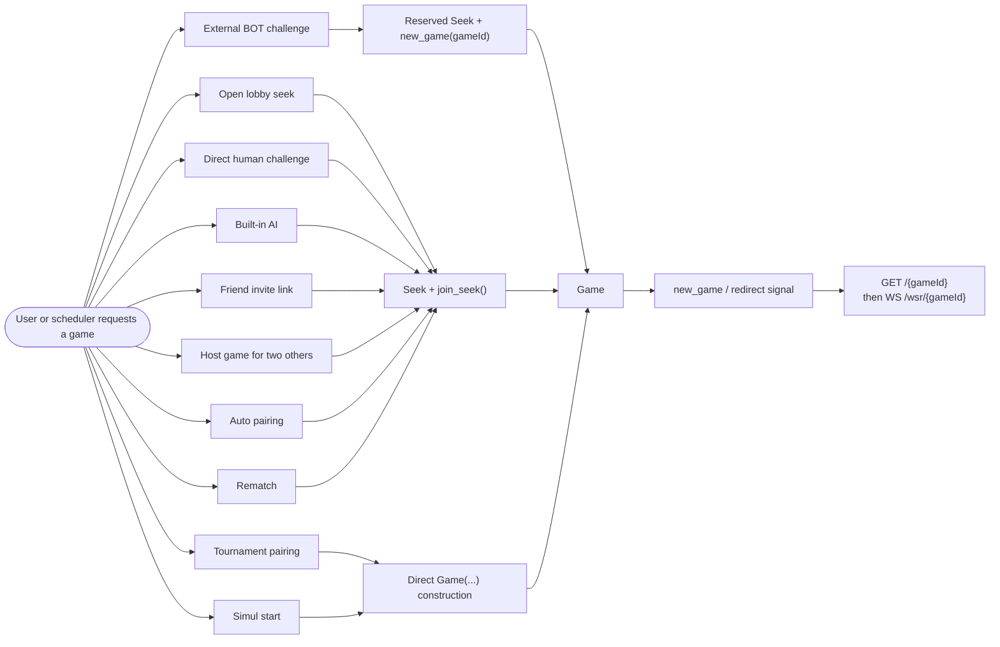

### Entry-point and completion matrix

| Creation method | Initial browser route/UI | Creation request | Waiting/state channel | Operation that actually completes the game | Redirect signal |
|---|---|---|---|---|---|
| Open lobby seek | `/`, `/seek/{variant}`, `client/lobby.ts` | WS `create_seek` | WS `get_seeks` | WS `accept_seek` -> `join_seek()` | WS `new_game` to both players |
| Direct human challenge | `/@/{profileId}/challenge`, lobby dialog | WS `create_seek` with `target=<username>` | Challenge SSE + `/challenges` | HTTP POST `.../{seekId}/accept` or lobby WS `accept_seek` | HTTP `new_game`, challenge SSE `gameId`, or lobby WS `new_game`, depending on acceptance path/connectivity |
| Built-in AI | Lobby dialog / `?ai`, `client/lobby.ts` | WS `create_ai_challenge` | None; immediate | Server creates a temporary `Seek`, then bot immediately `join_seek()` | WS `new_game` |
| External BOT | `/@/{bot}/challenge`, lobby dialog | WS `create_bot_challenge` | Bot event stream + browser invite SSE | BOT POST `/api/challenge/{gameId}/accept` -> `new_game(..., gameId)` | Browser invite SSE `{accept:true}`; BOT receives game-start event |
| Friend invite | Lobby “Play with a friend” | WS `create_invite` | Invite page + invite SSE | Visitor POST `/invite/accept/{gameId}` -> `join_seek(..., gameId)` | Invite SSE causes both pages to reload `/invite/{gameId}`, which now renders round view |
| Host game | Tournament-director “Host a game for others” | WS `create_host` | Invite page + invite SSE | First visitor fills one seat; second visitor triggers `new_game(..., gameId)` | Invite SSE reloads all waiting pages |
| Auto pairing | Lobby auto-pair controls | WS `create_auto_pairing` | In-memory pairing pools | `auto_pair()` builds/reuses a `Seek`, then `join_seek()` | WS `new_game` to both lobby socket sets |
| Rematch | Existing round page | Round WS `rematch` | Existing game/round messaging | Second offer, or immediate BOT rematch, creates a `Seek` and calls `join_seek()` | Round WS `new_game` / `view_rematch` |
| Tournament | Tournament scheduler | Internal method call | Tournament websocket `/wst` | `Tournament.create_games()` constructs `Game` directly | Tournament WS `new_game` |
| Simul | Host starts simul | Simul WS action/internal call | Simul websocket `/wss` | `Simul.create_games()` constructs one `Game` per opponent | Simul WS `new_game` |

## 4. Shared runtime state

The same `Seek` object is indexed in different runtime dictionaries depending on the creation method.

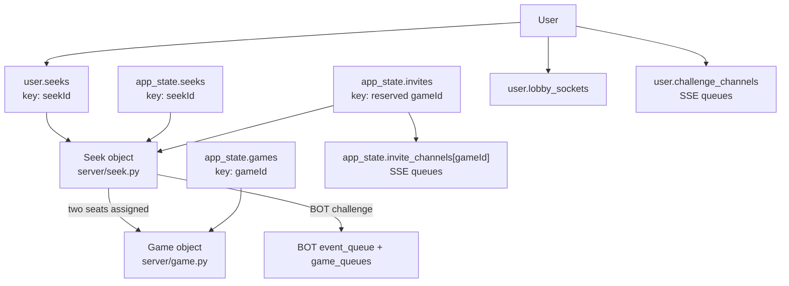

Rules of thumb:

- Every normal pending seek is stored in `app_state.seeks` and in the creator's `user.seeks`.
- Friend invites, host games, and external BOT challenges additionally reserve a `gameId` and store `app_state.invites[gameId] = seek`.
- `new_game()` removes the reserved invite entry when called with that `gameId`.
- A successfully created live game is stored in `app_state.games[gameId]` and normally inserted into MongoDB by `insert_game_to_db()`.
- Direct challenges retain their `Seek` long enough to expose the terminal `accepted` state; ordinary seeks are removed when the game is created.

## 5. Open lobby seek

### Files involved

- HTTP page: `server/views/lobby.py`
- Client controller: `client/lobby.ts`
- Lobby websocket route: `/wsl` in `server/routes.py`
- Lobby websocket handlers: `server/wsl.py`
- Seek model/creation/filtering: `server/seek.py`
- Per-user seek broadcasting: `server/lobby.py`
- Game construction: `server/utils.py`

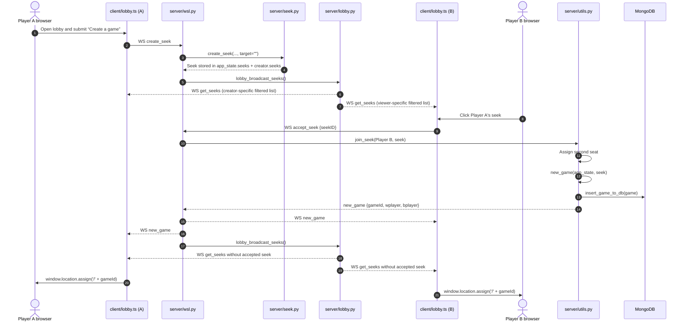

### Important branch: two-board seeks

`handle_accept_seek()` checks `get_server_variant(...).two_boards`. Two-board variants branch into `server/bug/utils_bug.py` rather than the ordinary `join_seek()` path. Targeted friend invites and direct challenges are rejected for two-board variants because those flows model only one or two seats.

## 6. Direct human challenge

A direct challenge begins in the lobby dialog but, after creation, uses a dedicated challenge page and a shared site-wide challenge panel. This is a **hybrid WebSocket + HTTP + SSE flow**.

### Files involved

- Entry route: `/@/{profileId}/challenge` -> `server/views/lobby.py`
- Creation UI: `client/lobby.ts`
- Creation handler: `server/wsl.py::handle_create_seek()`
- Challenge waiting page: `server/views/direct_challenge.py`, `client/directChallenge.ts`
- Global challenge panel: `client/challengeView.ts`
- Challenge REST/SSE: `server/header_challenges.py`
- Routes: `server/routes.py`

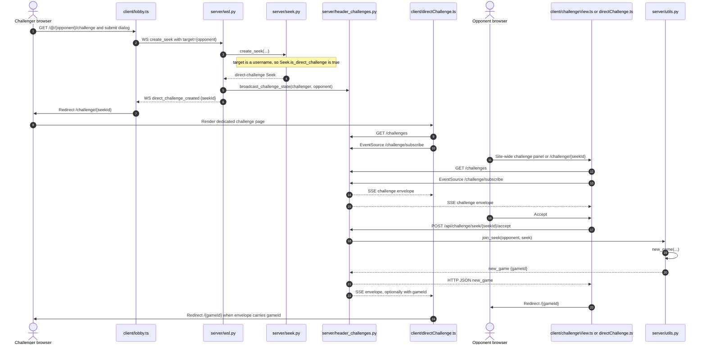

### Direct-challenge status lifecycle

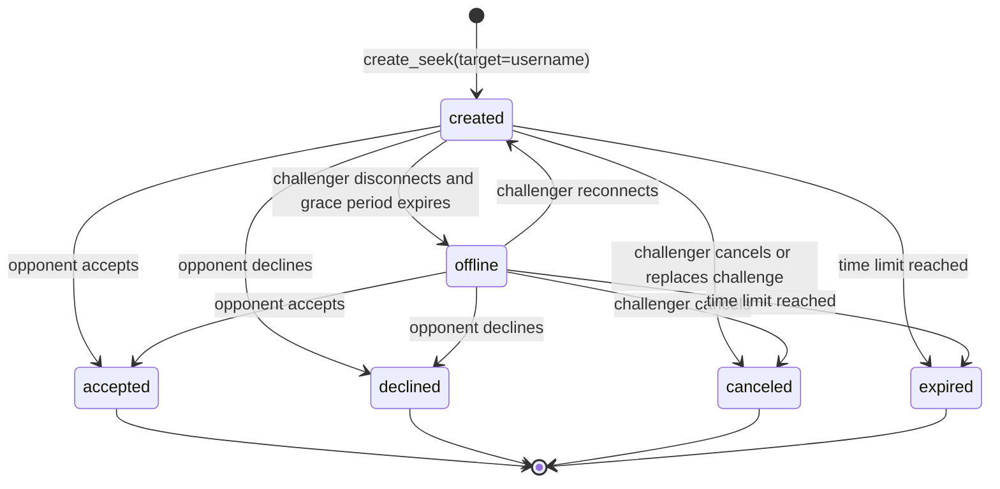

### Redirect delivery detail

There are two acceptance paths:

1. **HTTP challenge action** from `client/challengeView.ts` or `client/directChallenge.ts`: the acceptor receives the `new_game` object directly as the POST response. The challenger is updated through challenge SSE; `gameId` is attached to the challenger envelope when there is no active lobby websocket.
2. **Lobby seek click** from `client/lobby.ts`: `accept_seek` is sent on `/wsl`, and `server/wsl.py` sends `new_game` through lobby websockets and also broadcasts the challenge state.

## 7. Built-in AI game

The built-in AI path does not publish a waiting seek. The server creates a temporary `Seek`, immediately joins the chosen engine, and returns `new_game` on the same lobby websocket.

### Files involved

- Client: `client/lobby.ts::createAIChallengeMsg()`
- Handler: `server/wsl.py::handle_create_ai_challenge()`
- Seat assignment/game construction: `server/utils.py`
- BOT start notification: `send_bot_game_start_unless_streaming()`

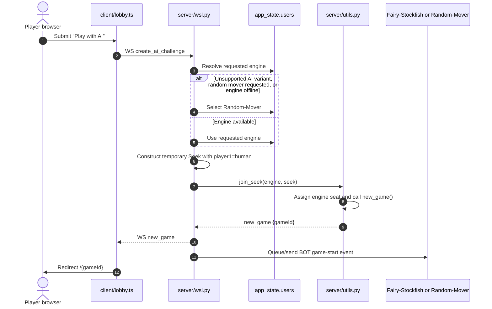

## 8. External BOT challenge

This flow is different from built-in AI:

- the browser creates a reserved challenge;
- the BOT receives a challenge event through the BOT API stream;
- the BOT explicitly accepts or declines through HTTP;
- the human waits on `/bot-challenge/{gameId}` and receives the decision through SSE.

### Files involved

- Creation client: `client/lobby.ts`
- Creation handler: `server/wsl.py::handle_create_bot_challenge()`
- BOT event serialization: `server/seek.py::challenge()`
- Human waiting page: `server/views/bot_challenge.py`, `client/botChallenge.ts`
- BOT accept/decline: `server/bot_api.py`
- SSE queues: `server/game_api.py::subscribe_invites()`

```mermaid
sequenceDiagram
    autonumber
    actor H as Human browser
    participant L as client/lobby.ts
    participant WSL as server/wsl.py
    participant Seek as server/seek.py
    participant BotStream as BOT event stream
    actor B as External BOT
    participant BotAPI as server/bot_api.py
    participant Page as client/botChallenge.ts
    participant SSE as server/game_api.py invite SSE
    participant Utils as server/utils.py

    H->>L: Submit challenge to BOT profile
    L->>WSL: WS create_bot_challenge
    WSL->>Seek: create_seek(target="BOT_challenge", engine=BOT)
    Note over Seek: Reserve gameId; player1=human; player2=BOT;<br/>store app_state.invites[gameId]=seek
    WSL->>BotStream: Queue challenge event
    WSL-->>L: WS bot_challenge_created {gameId}
    L->>H: Redirect /bot-challenge/{gameId}
    H->>Page: Render waiting page
    Page->>SSE: EventSource /api/bot-challenges/{gameId}

    alt BOT accepts
        B->>BotAPI: POST /api/challenge/{gameId}/accept
        BotAPI->>Utils: new_game(app_state, seek, gameId)
        Utils-->>BotAPI: new_game
        BotAPI-->>SSE: {gameId, accept:true}
        BotAPI-->>B: HTTP {ok:true} + BOT game-start stream event
        SSE-->>Page: accepted event
        Page->>H: Redirect /{gameId}
    else BOT declines
        B->>BotAPI: POST /api/challenge/{gameId}/decline
        BotAPI->>Seek: Set decline reason/status
        BotAPI-->>SSE: {gameId, accept:false, declineReason}
        SSE-->>Page: declined event
        Page->>H: Render decline reason
    end
```

## 9. Friend invite link

A normal friend invite reserves the final game ID before the second player arrives. The creator already occupies one seat.

### Files involved

- Creation: `client/lobby.ts`, `server/wsl.py::handle_create_invite()`
- Reserved seek: `server/seek.py::create_seek()`
- Waiting/acceptance HTTP view: `server/views/invite.py`
- Waiting client/SSE: `client/invite.ts`, `server/game_api.py::subscribe_invites()`

```mermaid
sequenceDiagram
    autonumber
    actor C as Creator browser
    participant L as client/lobby.ts
    participant WSL as server/wsl.py
    participant Seek as server/seek.py
    participant InvitePage as server/views/invite.py
    participant InviteClient as client/invite.ts
    participant SSE as server/game_api.py
    actor F as Friend browser
    participant Utils as server/utils.py

    C->>L: Submit “Play with a friend”
    L->>WSL: WS create_invite
    WSL->>Seek: create_seek(target="Invite-friend")
    Note over Seek: Reserve gameId; player1=creator;<br/>app_state.invites[gameId]=seek
    WSL-->>L: WS invite_created {gameId}
    L->>C: Redirect /invite/{gameId}
    C->>InvitePage: GET /invite/{gameId}
    InvitePage-->>InviteClient: Render creator waiting view + share URL
    InviteClient->>SSE: EventSource /api/invites/{gameId}

    C-->>F: Share /invite/{gameId}
    F->>InvitePage: GET /invite/{gameId}
    InvitePage-->>F: Render JOIN THE GAME
    F->>InvitePage: POST /invite/accept/{gameId}
    InvitePage->>Utils: join_seek(friend, seek, gameId)
    Utils->>Utils: Second seat filled; new_game(..., gameId)
    Utils-->>InvitePage: new_game
    InvitePage-->>SSE: Queue {gameId, accept:true}
    SSE-->>InviteClient: Event for creator
    SSE-->>F: Event for friend page, if still subscribed
    InviteClient->>C: Reload /invite/{gameId}
    InvitePage-->>F: POST response renders view="round"
    Note over InvitePage: gameId now exists in app_state.games,<br/>so invite() loads the game and supplies round context
```

## 10. Tournament-director hosted game

A hosted game uses the same invite page and reserved-ID machinery, but the creator deliberately occupies **no seat**. The first two visitors become the players.

```mermaid
sequenceDiagram
    autonumber
    actor D as Tournament director
    participant L as client/lobby.ts
    participant WSL as server/wsl.py
    participant Seek as server/seek.py
    participant P1 as First visitor
    participant P2 as Second visitor
    participant Invite as server/views/invite.py
    participant Utils as server/utils.py
    participant SSE as Invite SSE

    D->>L: Submit “Host a game for others”
    L->>WSL: WS create_host
    WSL->>Seek: create_seek(..., empty=true)
    Note over Seek: player1=None; player2=None;<br/>reserved gameId in app_state.invites
    WSL-->>L: WS host_created {gameId}
    L->>D: Redirect /invite/{gameId}
    Note over D: Page shows separate player1/player2 invite URLs

    P1->>Invite: POST /invite/accept/{gameId}/player1
    Invite->>Utils: join_seek(P1, join_as="player1")
    Utils-->>Invite: seek_joined
    Invite-->>P1: Waiting for other player

    P2->>Invite: POST /invite/accept/{gameId}/player2
    Invite->>Utils: join_seek(P2, join_as="player2")
    Utils->>Utils: Both seats filled; new_game(..., gameId)
    Utils-->>Invite: new_game
    Invite-->>SSE: {gameId, accept:true}
    SSE-->>D: Reload waiting page
    SSE-->>P1: Reload waiting page
    Note over D,P2: All viewers now reach /invite/{gameId},<br/>which renders the round for the created game
```

## 11. Automatic pairing

Auto pairing can match:

- two compatible users already in auto-pairing pools; or
- one auto-pairing user with an existing compatible normal rated seek.

### Files involved

- Client messages: `client/lobby.ts`
- Message dispatch: `server/wsl.py`
- Pool matching and game creation: `server/auto_pair.py`
- Shared completion: `server/utils.py::join_seek()`

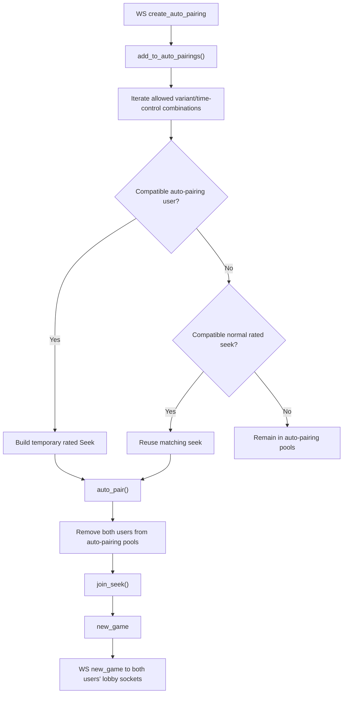

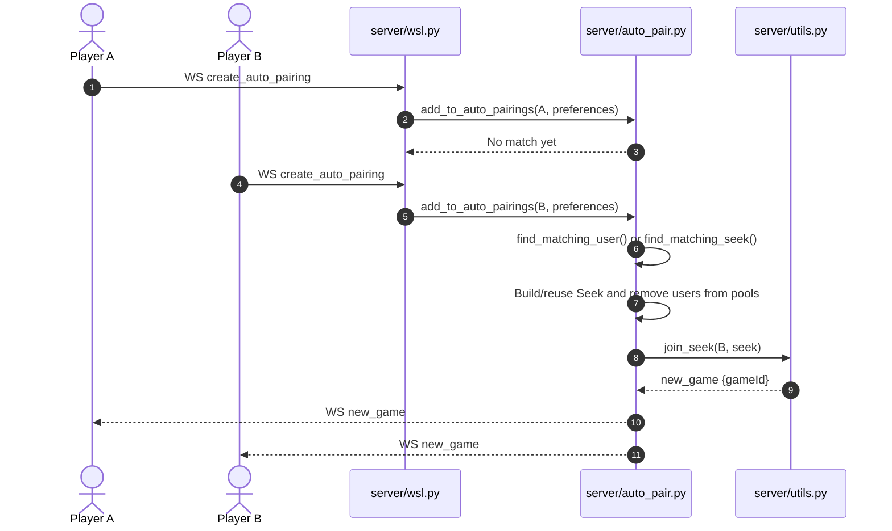

## 12. Rematch

Rematches start from an existing round and therefore use `/wsr/{gameId}`, not `/wsl`.

### Files involved

- Client action/receive switch: `client/roundCtrl.ts`
- Round websocket handler: `server/wsr.py::handle_rematch()`
- Shared game creation: `server/utils.py::join_seek()`
- Two-board special case: `server/bug/wsr_bug.py`

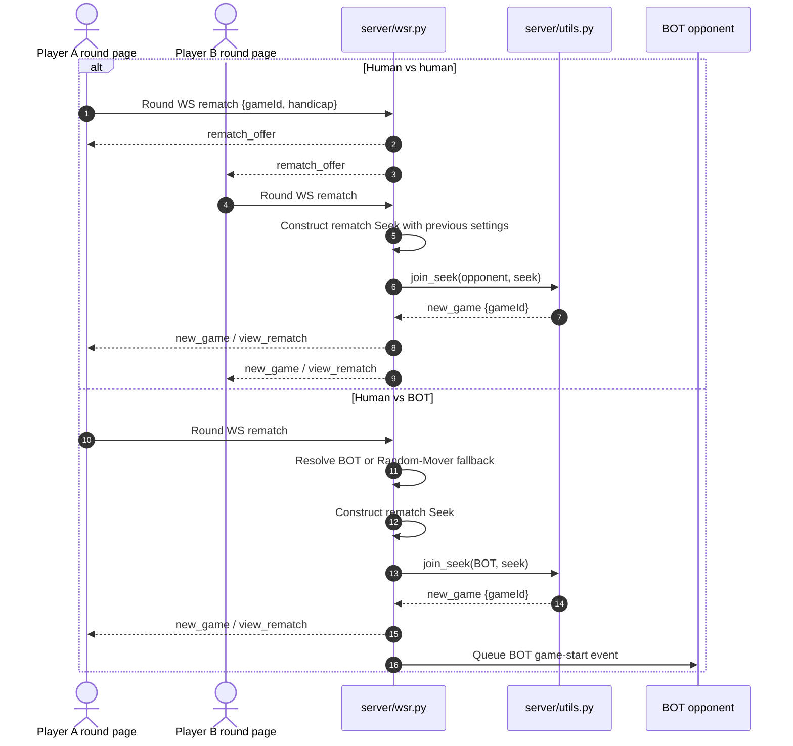

## 13. Tournament and simul creation

These paths deliberately bypass `Seek`, `join_seek()`, and `new_game()`. Their schedulers already know both players and construct `Game` objects directly.

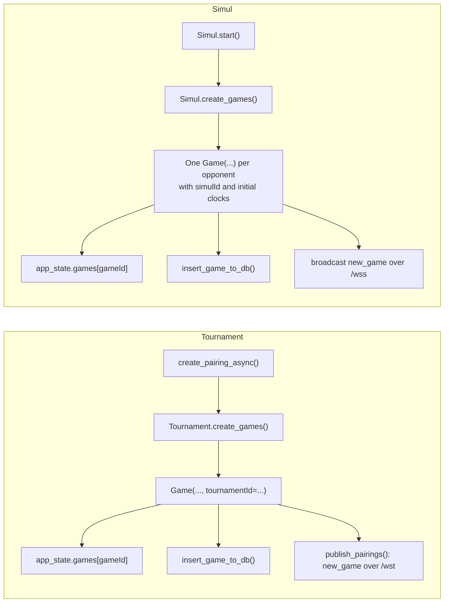

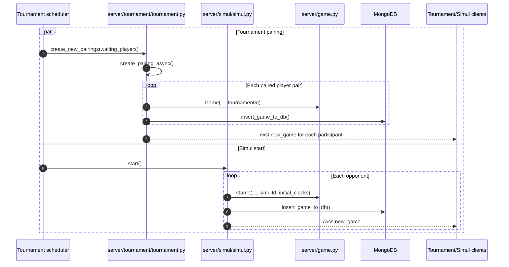

## 14. The common `join_seek()` / `new_game()` algorithm

This is the central flow used by ordinary lobby games, direct challenges, friend/host invites, auto pairing, AI games, and rematches.

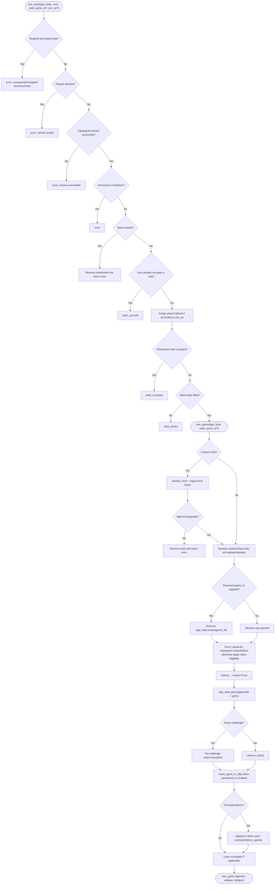

## 15. Handoff from `new_game` to the round board

Game creation and game play use different connections. After receiving a game ID, the browser navigates to the HTTP round page and then opens a game-specific round websocket.

### Files involved

- Route declaration: `server/routes.py`
- HTTP dispatcher: `server/views/game.py`
- Round context: `server/views/round_view.py`
- Client view dispatch: `client/main.ts`
- Round UI: `client/round.ts`, `client/roundCtrl.ts`
- Round websocket: `server/wsr.py`

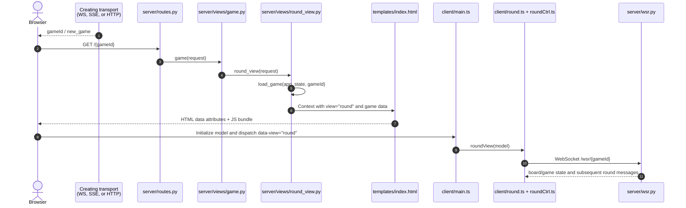

## 16. Route map

All route registrations live in `server/routes.py`.

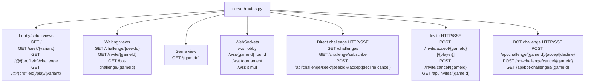

## 17. WebSocket and SSE message map

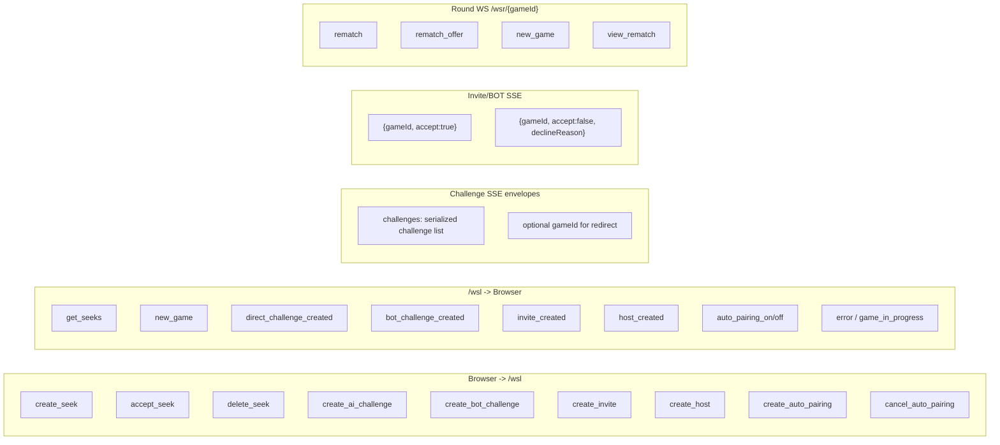

## 18. File responsibility map

```mermaid
flowchart TB
    subgraph Client["Client"]
        CLobby["client/lobby.ts<br/>setup dialog, /wsl messages, redirects"]
        CChallenge["client/challengeView.ts<br/>global challenge panel"]
        CDirect["client/directChallenge.ts<br/>dedicated challenge page"]
        CInvite["client/invite.ts<br/>invite/host page + SSE"]
        CBot["client/botChallenge.ts<br/>BOT waiting page + SSE"]
        CRound["client/roundCtrl.ts<br/>round socket + rematches"]
        CMain["client/main.ts<br/>data-view dispatch"]
    end

    subgraph HTTPViews["HTTP views"]
        VLobby["server/views/lobby.py"]
        VDirect["server/views/direct_challenge.py"]
        VInvite["server/views/invite.py"]
        VBot["server/views/bot_challenge.py"]
        VGame["server/views/game.py"]
        VRound["server/views/round_view.py"]
    end

    subgraph Coordination["Realtime/API coordination"]
        SWsl["server/wsl.py<br/>lobby WS dispatch/handlers"]
        SLobby["server/lobby.py<br/>filtered lobby broadcasts"]
        SChallenge["server/header_challenges.py<br/>challenge REST + SSE"]
        SGameAPI["server/game_api.py<br/>invite SSE + cancel"]
        SBotAPI["server/bot_api.py<br/>BOT accept/decline"]
        SWsr["server/wsr.py<br/>round WS + rematches"]
        SAuto["server/auto_pair.py"]
    end

    subgraph Domain["Domain/core"]
        SSeek["server/seek.py<br/>Seek, create_seek, serialization"]
        SUtils["server/utils.py<br/>join_seek, new_game, persistence"]
        SGame["server/game.py<br/>Game runtime model"]
        STypes["server/ws_types.py<br/>message TypedDicts"]
        SRoutes["server/routes.py<br/>route registrations"]
    end

    CLobby --> VLobby
    CLobby --> SWsl
    CChallenge --> SChallenge
    CDirect --> VDirect
    CDirect --> SChallenge
    CInvite --> VInvite
    CInvite --> SGameAPI
    CBot --> VBot
    CBot --> SGameAPI
    CRound --> SWsr
    CMain --> CLobby
    CMain --> CDirect
    CMain --> CInvite
    CMain --> CBot
    CMain --> CRound

    SWsl --> SSeek
    SWsl --> SUtils
    SWsl --> SLobby
    SChallenge --> SUtils
    VInvite --> SUtils
    SBotAPI --> SUtils
    SWsr --> SUtils
    SAuto --> SUtils
    SUtils --> SGame
    SRoutes --> HTTPViews
    SRoutes --> Coordination
    STypes --> SWsl
```

### Practical “where should I look?” table

| Question | Primary file(s) |
|---|---|
| Which setup mode sends which message? | `client/lobby.ts`, especially the `createMode` switch and `create*Msg()` methods |
| Where are `/wsl` messages dispatched? | `server/wsl.py::process_message()` |
| How is a pending seek represented and stored? | `server/seek.py::Seek`, `create_seek()` |
| Why can one user see a seek while another cannot? | `server/seek.py::get_seeks()` and `User.compatible_with_seek()` |
| How are viewer-specific seek lists broadcast? | `server/lobby.py::lobby_broadcast_seeks()` |
| Where are seats assigned? | `server/utils.py::join_seek()` |
| Where is the actual `Game` built? | Usually `server/utils.py::new_game()`; directly in tournament/simul code for those modes |
| Where is the game inserted into MongoDB? | `server/utils.py::insert_game_to_db()` |
| How do direct challenge notifications work? | `server/header_challenges.py`, `client/challengeView.ts` |
| How do invite pages learn that a game started? | `server/game_api.py::subscribe_invites()`, `client/invite.ts` |
| How does an external BOT accept? | `server/bot_api.py::challenge_accept()` |
| How does a new game become a round page? | `server/views/game.py`, `server/views/round_view.py`, `client/main.ts`, `client/roundCtrl.ts` |
| How are rematches created? | `server/wsr.py::handle_rematch()` |
| Where do two-board games diverge? | `server/wsl.py`, `server/bug/utils_bug.py`, `server/bug/wsr_bug.py` |

## 19. Creation result/state summary

```mermaid
stateDiagram-v2
    [*] --> PendingSpecification
    PendingSpecification --> WaitingForOpponent: open seek / direct / invite / BOT / auto-pair
    PendingSpecification --> CreatingImmediately: built-in AI / matched auto-pair / rematch
    PendingSpecification --> CreatingDirectly: tournament / simul

    WaitingForOpponent --> OneSeatFilled: host game first visitor
    OneSeatFilled --> CreatingImmediately: host game second visitor
    WaitingForOpponent --> CreatingImmediately: seek accepted / direct accepted / invite accepted / BOT accepted
    WaitingForOpponent --> TerminalWithoutGame: canceled / declined / expired

    CreatingImmediately --> GameInMemory: Game constructed
    CreatingDirectly --> GameInMemory: Game constructed
    GameInMemory --> Persisted: insert_game_to_db when enabled
    GameInMemory --> RedirectSignaled: new_game / SSE / HTTP redirect
    Persisted --> RedirectSignaled
    RedirectSignaled --> RoundPage: GET /{gameId}
    RoundPage --> RoundConnected: WS /wsr/{gameId}
    RoundConnected --> [*]
    TerminalWithoutGame --> [*]
```

## 20. Non-live game record creation: PGN import

`server/utils.py::import_game()` also constructs a temporary `Game` and inserts a document into MongoDB. It differs from the flows above:

- the record is marked `IMPORTED`;
- `Game(..., create=False)` is used;
- it is not placed into `app_state.games` as a live game;
- no `new_game` realtime message is broadcast;
- the temporary stopwatch is canceled after validation/import.

It should be documented as **game-record import**, not as live matchmaking/game creation.

## 21. Compact end-to-end summary

```mermaid
flowchart LR
    Setup["Setup UI or scheduler"]
    Spec["Seek or direct pairing specification"]
    Seats["Resolve both players/seats"]
    Construct["Construct Game"]
    Store["Cache + optional MongoDB insert"]
    Signal["Deliver gameId"]
    Page["GET /{gameId}"]
    Socket["WS /wsr/{gameId}"]

    Setup --> Spec --> Seats --> Construct --> Store --> Signal --> Page --> Socket

    Note1["Lobby/direct/invite/AI/auto/rematch<br/>normally use Seek + join_seek + new_game"] -.-> Spec
    Note2["Tournament/simul<br/>construct Game directly"] -.-> Construct
    Note3["Friend/host/BOT challenges<br/>reserve gameId before Game exists"] -.-> Spec
```
